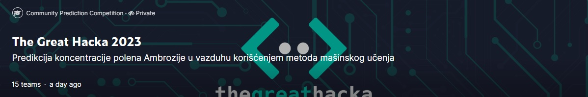
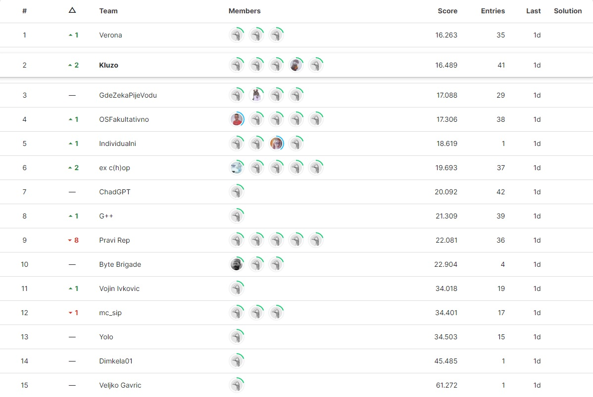

# Ambrosia_concentration_prediction_The_Great_Hacka_2023

# Team "Kluzo" members 
Vanja Kovinić, Vid Nikolić, Jefimija Najdić, Luka Lazarević and me. 

# The hackathon aka The Great Hacka 2023
The idea for this competition was to predict the concentration of pollen for the upcoming 3 days based on the previous 10 days. 
The hackathon competition was held on kaggle and the end results for the models we're the following: 

# How the competition went
We had a lot of fun working together in a team and also gained a lot of knowledge. The hackathon was competitive to the finish as 
the leaderboard was changing dynamically every moment. All the teams were trying to grasp even the slightest form of improvement 
on their models considering the difference between scores being in decimal points. The competition was tough due to it lasting 24h 
and a lot of teams getting almost no sleep considering almost all of us stayed overnight, but it was very exciting due to the reasons 
mentioned and the awesome people that we're a part of it. The organizers we're caring as well and ready to support.
